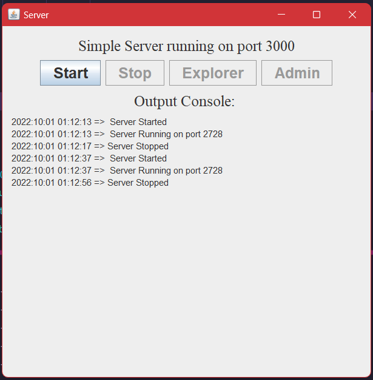

<center><h1>SCS 2105 Computer Network Assignment<h3>Weerasinghe M.A.D.V</h3>2020/CS/202</h1></center>

<h2>How to Run</h2>

Navigate to the directory where zip extracted and run the following command

```bash
$ cd SimpleServer
$ java -jar target/ServerApplication.jar
```
<h2>Preview of the Application</h2>


<h2>How to use</h2>
Server will be running on default port 2728. You can access the application using the following url

```bash
http://localhost:2728/
```

Use the following directory structure to work with the application

```bash
    SimpleServer/htdocs
```
